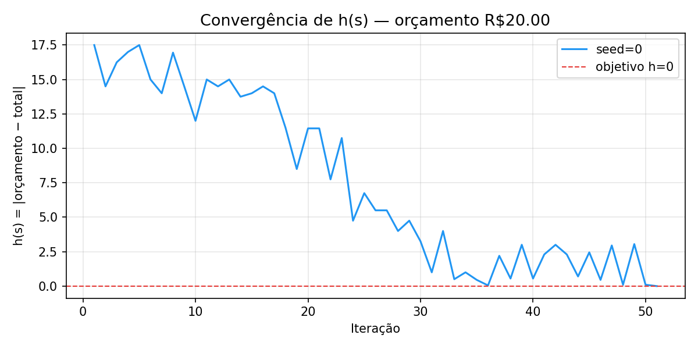
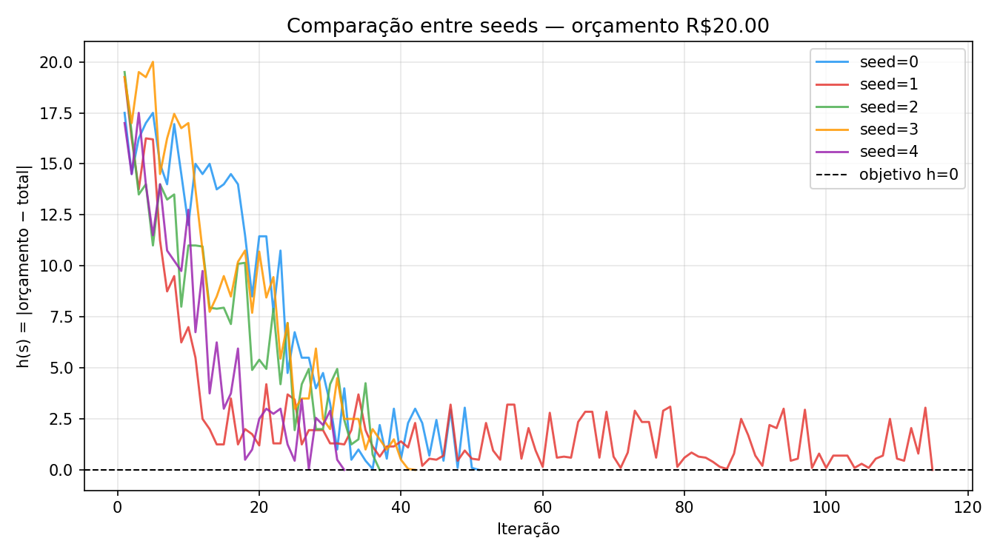
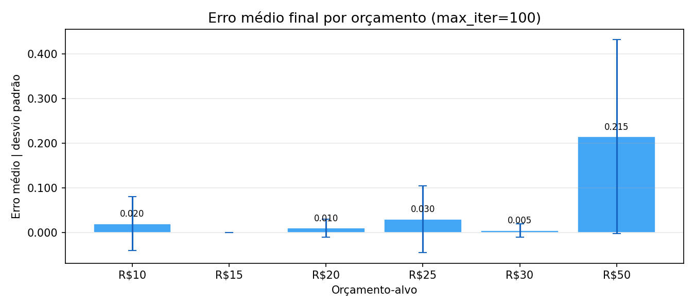
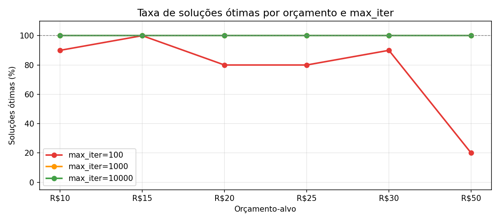

# Relatório Técnico
## Problema da Feira — Busca em Espaço de Estados, Agentes Inteligentes e Heurísticas

---

> **Grupo:**  The Best Of The Class
>
> **Integrantes:**  Anna Leticia do Nascimento Soares Duarte, Alice Mariana de Souza, Gustavo de Morais Lopes e Vitória Eloise de Assis Rocha
>
> **Repositório:**  <https://github.com/annadrt/thebestoftheclass-ia1-problema-da-feira> 
>
> **Data de entrega:** 22 de junho de 2026

---

> A contextualização teórica deste relatório — modelagem formal, relação
> com o AIMA, busca, XAI e sustentabilidade — está disponível em
> [`docs/README.md`](README.md) e deve ser utilizada como base para a redação das
> seções abaixo. O relatório deve ser autoral: não copie a contextualização,
> aplique-a à sua implementação.

---

# Sumário

- [1. Introdução](#1-introdução)
- [2. Modelagem Formal](#2-modelagem-formal)
- [3. Representação em Grafo](#3-representação-em-grafo)
- [4. Busca Não Informada](#4-busca-não-informada)
- [5. Busca Heurística](#5-busca-heurística)
- [6. Busca em Caminho](#6-busca-em-caminho)
- [7. Agente Inteligente](#7-agente-inteligente)
- [8. Resultados Experimentais](#8-resultados-experimentais)
- [9. Discussão Conceitual](#9-discussão-conceitual)
- [10. Conclusão](#10-conclusão)
- [Referências Bibliográficas](#referências-bibliográficas)

---

## 1. Introdução

  Este relatório descreve a implementação e análise de um agente inteligente para o Problema da Feira, cujo objetivo é identificar uma combinação de itens de mercado cujo valor total seja igual ou o mais próximo possível de um orçamento pré-definido. O problema pertence à classe dos problemas de otimização combinatória, sendo modelado formalmente como um problema de busca em espaço de estados e resolvido por meio de um agente heurístico estocástico.
O trabalho dialoga diretamente com os fundamentos de Inteligência Artificial apresentados em Russell e Norvig (2021), em especial com os capítulos dedicados a agentes racionais, formulação de problemas de busca, busca local e heurísticas. O agente implementado, denominado Alice, opera em um ambiente totalmente observável, estático, determinístico e discreto, executando um ciclo percepção–deliberação–ação orientado pela minimização de uma função heurística de erro absoluto.
Além do interesse técnico-algorítmico, a atividade possui dimensão pedagógica ampla: permite discutir por que abordagens de IA clássica — simbólicas, heurísticas e auditáveis — continuam relevantes e, em muitos contextos práticos, preferíveis a modelos de aprendizado profundo. Questões de sustentabilidade computacional, interpretabilidade (XAI), governança algorítmica e regulamentação — incluindo o PL 2688/2025 — são discutidas ao longo do relatório à luz da implementação realizada.
Os objetivos específicos desta atividade são:
-> modelar formalmente o problema como um espaço de estados;
-> implementar um agente heurístico estocástico com melhoria iterativa;
-> analisar experimentalmente o comportamento do agente sob diferentes parâmetros;
-> discutir as relações conceituais com busca não informada, busca informada e agentes racionais;
-> refletir sobre interpretabilidade, auditabilidade e sustentabilidade da solução.


---

## 2. Modelagem Formal

 ## 2. Modelagem Formal

### Ambiente

O ambiente é definido pelo par $E = (I, O)$, onde $I = \{i_1, i_2, \ldots, i_n\}$ é o conjunto de itens disponíveis com preços $p : I \to \mathbb{R}^+$, e $O \in \mathbb{R}^+$ é o orçamento-alvo.

| Propriedade | Valor |
|---|---|
| Observabilidade | Totalmente observável |
| Dinamismo | Estático |
| Determinismo | Determinístico |
| Domínio | Discreto |
| Cardinalidade | Finito |
| Comportamento do agente | Estocástico |

---

### Estado

Um estado $s$ é uma função que mapeia cada item a uma quantidade inteira não negativa:

$$s : I \to \mathbb{N}$$

O custo total associado a um estado é:

$$\text{TOTAL}(s) = \sum_{i \in I} s(i) \cdot p(i)$$

**Exemplo:**

```
{
  "Laranja":  3,
  "Banana":  10,
  "Melancia":  3,
  "Melão":   2,
  "Manga":   2
}
```

O estado inicial é a cesta vazia $s_0$, onde $s_0(i) = 0\ \forall\, i \in I$, com $\text{TOTAL}(s_0) = 0$.

---

### Ações

O agente dispõe de três operadores de transição. Cada ação define uma função de transição $T : \mathcal{S} \times \mathcal{A} \to \mathcal{S}$.

| Operador | Definição | Precondição |
|---|---|---|
| $\text{adicionar}(i)$ | $s'(i) = s(i) + 1$ | nenhuma |
| $\text{remover}(i)$ | $s'(i) = s(i) - 1$ | $s(i) > 0$ |
| $\text{substituir}(i, j)$ | $s'(i) = s(i) - 1,\; s'(j) = s(j) + 1$ | $s(i) > 0,\; i \neq j$ |

---

### Espaço de Estados

O espaço de estados $\mathcal{S}$ é modelado como um **grafo implícito** $G = (\mathcal{S},\, \mathcal{A})$:

- **Nós** → estados $s \in \mathcal{S}$
- **Arestas** → ações $a \in \mathcal{A}$ que transitam $s \to s'$
- **Caminho** → sequência de ações $\pi = \langle s_0, s_1, \ldots, s_k \rangle$

O grafo é **implícito**: vizinhos são gerados sob demanda pela aplicação dos operadores, sem construção explícita na memória. O espaço de estados cresce combinatorialmente com o número de itens, tornando a busca exaustiva inviável mesmo para instâncias moderadas.

---

### Objetivo

O estado objetivo $s^*$ satisfaz:

$$h(s^*) = 0 \quad \Longleftrightarrow \quad \text{TOTAL}(s^*) = O$$

Na ausência de solução exata, o objetivo relaxado é:

$$s^* = \underset{s \in \mathcal{S}}{\arg\min}\ h(s)$$

O critério de parada é $h(s) = 0$ ou $\text{iterações} = \text{max\_iter}$.

---

### Heurística

$$h(s) = \left| O - \text{TOTAL}(s) \right|$$

A função $h(s)$ representa o erro absoluto entre o orçamento-alvo e o total atual da cesta. Suas propriedades:

- $h(s) = 0$ indica solução ótima
- $h(s) > 0$ indica distância ao objetivo
- É **admissível**: nunca superestima o custo real restante
- Guia a melhoria iterativa: o agente aceita transições $s \to s'$ quando $h(s') < h(s)$

---

### Ciclo do Agente

A cada iteração, o agente executa o ciclo perceber–agir:

```
perceber(s_t)
    → gerar vizinho s' via operador aleatório
    → calcular h(s')
    → aplicar política de aceitação
    → s_{t+1} = s' se h(s') < h(s_t), senão s_{t+1} = s_t
    → registrar em entradas_log
```

| Conceito (AIMA) | Implementação |
|---|---|
| Ambiente | CSV + orçamento |
| Percepção | estado atual da cesta |
| Agente | `agente_alice()` |
| Estado | dicionário `item → quantidade` |
| Ação | adicionar / remover / substituir |
| Espaço de estados | conjunto de cestas possíveis |
| Heurística | erro absoluto $h(s)$ |
| Objetivo | $h(s) = 0$ |
| Racionalidade | minimizar $h(s)$ dentro de `max_iter` | 

---

## 3. Representação em Grafo

  O espaço de estados do Problema da Feira é estruturado como um grafo implícito e direcionado, no qual cada nó representa um estado (configuração da cesta) e cada aresta representa a aplicação de um operador (ação do agente). O grafo é denominado implícito porque não é construído explicitamente na memória: os sucessores de um estado são gerados sob demanda durante a busca. 
 
3.1 Estrutura do Grafo:

Nó	--> Estado da cesta: mapeamento item → quantidade
Aresta	--> Aplicação de um operador (adicionar, remover, substituir)
Nó inicial	--> Cesta vazia: {Laranja:0, Banana:0, Melancia:0, Melão:0, Manga:0}
Nó objetivo -->	Qualquer estado com TOTAL = ORÇAMENTO (h(s) = 0)
Caminho -->	Sequência ordenada de ações executadas pelo agente
Peso da aresta	--> Variação de h(s) causada pela ação

3.2 Exemplo de Transições
Considerando o ambiente definido em data/feira.csv e um orçamento de R$ 5,00, a seguinte sequência ilustra transições no grafo:

Nó 0:  {Laranja:0, Banana:0, Melancia:0, Melão:0, Manga:0}  TOTAL=0,00  h=5,00

  ── adicionar(Melancia) -->
  
Nó 1:  {Laranja:0, Banana:0, Melancia:1, Melão:0, Manga:0}  TOTAL=3,00  h=2,00

  ── adicionar(Manga) -->
  
Nó 2:  {Laranja:0, Banana:0, Melancia:1, Melão:0, Manga:1}  TOTAL=3,75  h=1,25

  ── adicionar(Laranja) -->
  
Nó 3:  {Laranja:1, Banana:0, Melancia:1, Melão:0, Manga:1}  TOTAL=4,25  h=0,75

  ── adicionar(Manga) -->
  
Nó 4:  {Laranja:1, Banana:0, Melancia:1, Melão:0, Manga:2}  TOTAL=5,00  h=0,00 


O caminho acima representa uma solução ótima encontrada em 4 transições. Na prática, o agente pode percorrer caminhos muito mais longos — com avanços e retrocessos — antes de convergir para h(s) = 0, pois a seleção de ações é estocástica e nem toda transição reduz o erro.

3.3 Dimensionalidade do Espaço de Estados
Com 5 itens e quantidades potencialmente ilimitadas, o espaço de estados é tecnicamente infinito. Na prática, o orçamento impõe um limite superior para a quantidade de qualquer item: para Banana (R$ 0,05), por exemplo, o máximo possível com orçamento de R$ 20,00 é 400 unidades. Isso torna o espaço de estados finito, mas de cardinalidade muito elevada, inviabilizando abordagens exaustivas.


---

## 4. Busca Não Informada

Algoritmos de busca não informada, como BFS (Busca em Largura) e DFS (Busca em Profundidade), exploram o espaço de estados sem utilizar conhecimento do domínio além da definição do problema. Embora garantam completude e, em alguns casos, otimalidade, sua aplicação ao Problema da Feira é impraticável devido à dimensão do espaço de busca.
4.1 BFS — Busca em Largura
A BFS expandiria os nós por nível de profundidade, garantindo que a solução de menor caminho seja encontrada primeiro. Contudo, o fator de ramificação b do grafo do Problema da Feira é da ordem de 2|I| + |I|² ≈ 35 (10 ações de adicionar/remover × 5 itens, mais 25 substituições). A memória necessária para manter a fronteira de busca cresce como O(b^d), onde d é a profundidade da solução. Para d = 100, a fronteira teria mais de 35^100 nós — completamente inviável.
4.2 DFS — Busca em Profundidade
A DFS reduziria o consumo de memória para O(b·d), mas em espaços de estados potencialmente infinitos (ou ciclicamente conectados), pode divergir sem encontrar solução. Além disso, não garante que a solução encontrada seja ótima.
4.3 Explosão Combinatória
Este trecho ilustra o crescimento exponencial do espaço de busca
em função da profundidade (d), considerando um fator de ramificação
aproximado b ≈ 35.

Em problemas de busca em espaço de estados, cada estado pode gerar
múltiplos estados sucessores. Aqui, estimamos que cada estado gera
cerca de 35 novos estados.

O número de nós na fronteira cresce como b^d (crescimento exponencial),
o que torna buscas exaustivas (como BFS e DFS) inviáveis para profundidades grandes.

Exemplos:
d = 1   -> 35 nós
d = 5   -> ~5,2 × 10^7 nós
d = 10  -> ~2,7 × 10^15 nós
d = 50  -> ~10^77 nós
d = 100 -> ~10^154 nós

Esses valores mostram a chamada "explosão combinatória",
onde o espaço de busca cresce de forma impraticável.

Por isso, abordagens de busca não informada tornam-se inviáveis,
sendo necessário utilizar estratégias heurísticas,
que exploram apenas parte do espaço de estados de forma guiada,
sem necessidade de expansão completa da árvore de busca.


## 5. Busca Heurística
5. Busca Heurística
O agente Alice implementa uma estratégia de melhoria iterativa com heurística (iterative improvement), uma variante de hill climbing estocástico. A cada iteração, o agente gera um estado candidato por aplicação aleatória de um operador e o aceita se ele reduzir o valor de h(s).
5.1 Geração de Candidatos
A geração de candidatos segue o seguinte procedimento estocástico:
selecionar aleatoriamente um operador (adicionar, remover ou substituir);
selecionar aleatoriamente um item (ou par de itens, para substituição);
aplicar o operador ao estado atual, obtendo um estado candidato;
calcular h(candidato).

O uso de aleatoriedade controlada (via seed) garante que o agente explore regiões distintas do espaço de estados a cada execução, evitando ficar preso em mínimos locais triviais. A reprodutibilidade — fundamental para auditabilidade — é garantida pela fixação da seed.
5.2 Política de Aceitação
A política de aceitação mínima implementada é:
se h(candidato) < h(estado_atual):
    estado_atual ← candidato   # aceitar melhoria
senão:
    descartar candidato        # rejeitar

Esta política é equivalente ao algoritmo Hill Climbing (subida de encosta) aplicado à minimização de h(s). Ela é gulosa: aceita qualquer melhoria imediata sem considerar o impacto de longo prazo. Como extensão, pode-se adotar aceitação probabilística ao estilo Simulated Annealing, aceitando pioras com probabilidade decrescente, o que permite escapar de platôs e mínimos locais.
5.3 Melhoria Iterativa e Critério de Parada
O ciclo de busca se repete até que uma das condições de parada seja satisfeita:
h(s) = 0: solução ótima encontrada (status OTIMA);
número de iterações atingiu max_iter: retorna melhor estado encontrado (status APROXIMADA).

## 6. Busca em Caminho

 Nesta seção, analisa-se a natureza do processo de busca aplicado ao Problema da Feira e como ele se diferencia dos algoritmos tradicionais de busca em caminho (pathfinding) no espaço de estados.

Abordagem de Busca Local vs. Busca em Caminho Clássica

 Os algoritmos clássicos de busca em caminho (como Busca em Largura, Busca em Profundidade, A* ou Dijkstra) exploram o espaço de estados de forma a encontrar uma sequência exata de passos (um caminho ordenado) que conecta um estado inicial bem definido a um estado objetivo. Nesses sistemas, o custo do caminho percorrido é um fator crítico e o foco está na rota.
O Problema da Feira, conforme estruturado na atual implementação, afasta-se dessa dinâmica e adota uma abordagem de Busca Local e Melhoria Iterativa. O agente Alice altera incrementalmente a composição da sua cesta atual por meio de operadores de modificação (adicionar, remover ou substituir itens).
- Foco no Estado Final: O objetivo do algoritmo não é registrar ou otimizar o caminho (a ordem cronológica em que as frutas foram colocadas ou retiradas da sacola), mas puramente encontrar um estado de destino cuja configuração de itens resulte em um custo total o mais próximo possível do orçamento estipulado.
- Ausência de Grafo de Transição Explícito na Memória: Ao invés de expandir e armazenar uma árvore ou grafo de caminhos alternativos abertos (como faz o algoritmo A*), a busca local mantém em memória apenas o estado atual e seus candidatos gerados imediatamente na vizinhança. Isso reduz a complexidade de espaço para O(1), tornando o processo viável diante da explosão combinatória do catálogo de produtos.
 Caso o problema fosse convertido para uma busca em caminho estrita, cada nó do grafo representaria uma configuração parcial da cesta, e as arestas seriam as ações de transição. Contudo, devido ao fator de ramificação exponencial e à profundidade necessária para consumir orçamentos elevados, a busca local por melhoria iterativa se mostra uma estratégia computacionalmente mais adequada e robusta para o cenário industrial de otimização combinatória.

---

## 7. Agente Inteligente

 Esta seção dedica-se à caracterização e classificação taxonômica do agente implementado (Alice) com base nos conceitos fundamentais de Inteligência Artificial estabelecidos pela literatura clássica (AIMA - Russell & Norvig).

Classificação do Agente
 O agente Alice é classificado de forma proeminente como um Agente Baseado em Objetivos (Goal-Based Agent).

 A inteligência do sistema emerge do fato de que suas ações não são meras reações reflexas automáticas a estímulos imediatos. O agente possui uma descrição explícita de uma situação desejada — atingir o orçamento alvo minimizando o erro absoluto (h(s) = |orcamento - total(s)|) — e utiliza essa meta combinada com sua função heurística para avaliar e selecionar quais ações disponíveis no espaço de vizinhança devem ser executadas.

Mapeamento PEAS (Performance, Environment, Actuators, Sensors)

 Para formalizar o comportamento e o escopo operacional do sistema, a arquitetura é descrita através da matriz PEAS:
- Medida de Desempenho (Performance): A proximidade em relação ao orçamento alvo (erro de convergência igual a 0.0 para status OTIMA ou minimizado para status APROXIMADA), combinada com a eficiência computacional medida pelo número de iterações utilizadas.
- Ambiente (Environment): O mercado de compras virtual, cujas propriedades físicas irredutíveis são o catálogo de produtos e seus respectivos preços fornecidos dinamicamente pelo arquivo de entrada CSV.
- Atuadores (Actuators): As funções lógicas que executam os operadores de ação no sistema, alterando o dicionário do estado interno por meio de modificações discretas: adicionar item, remover item ou substituir item.
- Sensores (Sensors): O pipeline de leitura de dados que permite ao agente absorver e processar as percepções do ambiente, mapeando o arquivo de entrada e calculando o valor acumulado (total) da cesta corrente a cada ciclo.

Propriedades do Ambiente de Tarefa

 O ambiente no qual Alice atua possui propriedades bem delimitadas que ditam a complexidade do algoritmo:
- Totalmente Observável: O agente tem acesso completo e irrestrito a todas as informações relevantes do cenário de uma só vez através do carregamento do CSV (todos os itens e preços são conhecidos de antemão).
- Determinístico: O resultado de qualquer ação é perfeitamente previsível. Se o agente decide executar a ação de adicionar uma unidade de um item de valor conhecido, o custo final da cesta será alterado de forma exata e matemática, sem margem para ruídos ou incertezas físicas.
- Estático: O ambiente permanece imóvel e imutável enquanto o agente delibera. Os preços e a disponibilidade dos produtos no mercado não sofrem alterações dinâmicas no decorrer das iterações do laço de busca principal.
- Discreto: O espaço de estados e ações é finito e enumerável. As quantidades de itens são representadas por contadores inteiros e as iterações progridem em etapas lógicas sequenciais perfeitamente definidas.

---

## 8. Resultados Experimentais

Os experimentos foram conduzidos com `experimento.py`, executando o agente Alice para todas as combinações de 6 orçamentos × 3 limites de iterações × 10 seeds, totalizando 180 execuções individuais. Os resultados foram exportados para `src/data/resultados_experimento.csv` e os gráficos gerados por `visualizacao.py`.

---

### 8.1 Tabela de Resultados Agregados

| Orçamento | max\_iter | % Ótimas | Erro médio | Erro mín | Erro máx | DP erro | Iter médio |
|----------:|----------:|---------:|-----------:|---------:|---------:|--------:|-----------:|
| R$ 10,00  |       100 |    90,0% |     0,0200 |   0,0000 |   0,2000 |  0,0600 |       50,3 |
| R$ 10,00  |     1.000 |   100,0% |     0,0000 |   0,0000 |   0,0000 |  0,0000 |       55,6 |
| R$ 10,00  |    10.000 |   100,0% |     0,0000 |   0,0000 |   0,0000 |  0,0000 |       55,6 |
| R$ 15,00  |       100 |   100,0% |     0,0000 |   0,0000 |   0,0000 |  0,0000 |       43,1 |
| R$ 15,00  |     1.000 |   100,0% |     0,0000 |   0,0000 |   0,0000 |  0,0000 |       43,1 |
| R$ 15,00  |    10.000 |   100,0% |     0,0000 |   0,0000 |   0,0000 |  0,0000 |       43,1 |
| R$ 20,00  |       100 |    80,0% |     0,0100 |   0,0000 |   0,0500 |  0,0200 |       65,3 |
| R$ 20,00  |     1.000 |   100,0% |     0,0000 |   0,0000 |   0,0000 |  0,0000 |       67,2 |
| R$ 20,00  |    10.000 |   100,0% |     0,0000 |   0,0000 |   0,0000 |  0,0000 |       67,2 |
| R$ 25,00  |       100 |    80,0% |     0,0300 |   0,0000 |   0,2500 |  0,0748 |       60,6 |
| R$ 25,00  |     1.000 |   100,0% |     0,0000 |   0,0000 |   0,0000 |  0,0000 |       61,7 |
| R$ 25,00  |    10.000 |   100,0% |     0,0000 |   0,0000 |   0,0000 |  0,0000 |       61,7 |
| R$ 30,00  |       100 |    90,0% |     0,0050 |   0,0000 |   0,0500 |  0,0150 |       68,7 |
| R$ 30,00  |     1.000 |   100,0% |     0,0000 |   0,0000 |   0,0000 |  0,0000 |       71,1 |
| R$ 30,00  |    10.000 |   100,0% |     0,0000 |   0,0000 |   0,0000 |  0,0000 |       71,1 |
| R$ 50,00  |       100 |    20,0% |     0,2150 |   0,0000 |   0,7000 |  0,2169 |       99,2 |
| R$ 50,00  |     1.000 |   100,0% |     0,0000 |   0,0000 |   0,0000 |  0,0000 |      124,5 |
| R$ 50,00  |    10.000 |   100,0% |     0,0000 |   0,0000 |   0,0000 |  0,0000 |      124,5 |

---

### 8.2 Gráficos

**Gráfico 1 — Curva de convergência de h(s) (orçamento R$20,00, seed=0)**



O agente parte de h(s) ≈ 17,5 (cesta vazia) e reduz o erro progressivamente ao longo de ~50 iterações até atingir h(s) = 0. As oscilações na curva refletem candidatos gerados mas rejeitados — ações registradas no log independentemente da aceitação.

---

**Gráfico 2 — Comparação de curvas entre seeds distintas (orçamento R$20,00)**



As cinco curvas exibem o mesmo padrão de decaimento geral, mas com trajetórias distintas: seed=2 converge por volta da iteração 30, enquanto seed=1 oscila próximo de h≈1–3 por mais de 80 iterações antes de atingir h=0. Isso evidencia o impacto da seed sobre o caminho percorrido no espaço de estados sem comprometer a qualidade final da solução, já que todas as seeds convergem para OTIMA com max\_iter=1000.

---

**Gráfico 3 — Erro médio por orçamento (max\_iter=100)**



Com limite de 100 iterações, R$50,00 é o orçamento mais difícil: erro médio de 0,215 e desvio padrão de 0,217, com erro máximo de R$0,70 em uma das execuções. R$15,00 é o único orçamento que atinge 100% de soluções ótimas mesmo com max\_iter=100, pois sua decomposição em múltiplos de R$0,05 (Banana) é facilmente alcançável em poucas iterações.

---

**Gráfico 4 — Taxa de soluções ótimas por orçamento e max\_iter**



Com max\_iter ≥ 1000, o agente atinge 100% de soluções ótimas em todos os orçamentos testados. Com max\_iter=100, a taxa cai para 20% em R$50,00 — o agente não consegue convergir no tempo disponível para orçamentos maiores que exigem cestas com maior número de itens. As curvas de max\_iter=1000 e max\_iter=10000 são sobrepostas, indicando que 1000 iterações já é orçamento computacional suficiente para este ambiente.

---

### 8.3 Análise

**Efeito do orçamento.** Orçamentos maiores requerem cestas com mais itens ou quantidades maiores, aumentando o número médio de iterações necessárias para convergir. R$50,00 exige em média 124,5 iterações contra 43,1 de R$15,00. Isso é consistente com a expectativa de que o espaço de estados relevante cresce com o orçamento.

**Efeito do limite de iterações.** O limiar crítico está entre max\_iter=100 e max\_iter=1000. Acima de 1000 iterações, o agente converge para solução ótima em 100% das execuções para todos os orçamentos testados. Abaixo disso, orçamentos mais elevados sofrem degradação significativa — especialmente R$50,00, com apenas 20% de taxa ótima.

**Efeito da seed.** A seed controla o caminho explorado no espaço de estados mas não afeta a qualidade final da solução quando o orçamento computacional é suficiente. Com max\_iter=1000, todas as 10 seeds atingem OTIMA para todos os orçamentos, confirmando que o agente é robusto à variação de seed dentro desse limite. O desvio padrão do erro cai a zero para max\_iter ≥ 1000, indicando convergência determinística na prática.

---

## 9. Discussão Conceitual
---
 Nesta seção, realizamos uma reflexão crítica sobre as implicações teóricas, regulatórias e filosóficas que envolvem o desenvolvimento do Agente Alice no Problema da Feira, conectando as práticas laboratoriais aos desafios contemporâneos da engenharia de software e da governança algorítmica.
Inteligência Artificial Simbólica e Emergência do Comportamento
O ecossistema implementado baseia-se fundamentalmente no paradigma da IA Simbólica Clássica. A inteligência do sistema não reside em uma estrutura pré-programada de forma estática, mas emerge de maneira dinâmica a partir do alinhamento entre a representação de estados discretos (item: quantidade), a execução de operadores de vizinhança e a orientação matemática fornecida pela função heurística h(s). O laço iterativo em si atua como um motor cego; a cognição computacional e a capacidade de resolução do problema manifestam-se estritamente na interação do agente com as restrições físicas impostas pelo ambiente.
Racionalidade Limitada e Complexidade Computacional
Sob a perspectiva epistemológica do livro clássico do AIMA (Russell & Norvig), o agente atua sob as restrições da Racionalidade Limitada. Como o Problema da Feira é uma variação do Problema da Mochila (pertencente à classe de complexidade NP-completo), a busca exaustiva por forças combinatórias torna-se proibitiva devido ao crescimento exponencial do espaço de estados (b^d).
Ao limitar a execução através do parâmetro de controle computacional max_iter, o algoritmo abre mão da busca pela optimalidade absoluta em cenários extremos para fornecer soluções aproximadas de alta utilidade em tempo polinomial. O agente demonstra racionalidade ao maximizar o desempenho esperado dentro dos limites severos de tempo e memória que lhe foram outorgados.

XAI, Transparência e o Futuro Marco Regulatório Brasileiro (PL 2688/2025)

Com o avanço das discussões acerca do PL 2688/2025 e as diretrizes para o futuro marco regulatório de Inteligência Artificial no Brasil, conceitos como auditabilidade, rastreabilidade e responsabilidade algorítmica migraram do campo ético para obrigações legais severas.
O projeto antecipa com precisão esses desafios industriais por meio do desenvolvimento nativo de XAI (Explainable Artificial Intelligence):
- Rastreabilidade e Logs: A arquitetura do sistema rejeita a opacidade das abordagens "caixa-preta". O pipeline em main.py força a gravação de arquivos de log textuais estruturados (src/logs/), documentando o cabeçalho técnico de inicialização e o histórico passo a passo das transições de estados. Isso cumpre diretamente os requisitos de explicabilidade e transparência, permitindo reconstruir e justificar auditorias algorítmicas se o sistema tomar decisões inesperadas.
- Reprodutibilidade e Accountability: A inclusão mandatória de sementes pseudoaleatórias (seed) garante a reprodutibilidade dos testes estocásticos. Na governança corporativa, essa propriedade é vital para garantir o accountability (responsabilização), permitindo que falhas sistêmicas sejam replicadas de forma idêntica por peritos ou órgãos reguladores.
Desacoplamento Arquitetural e Replicabilidade Industrial
A divisão estrita entre a infraestrutura do ambiente (main.py), a inteligência local (solucao.py) e a análise experimental quantitativa (experimento.py) simula o design de software de grandes sistemas de tomada de decisão automatizada utilizados na indústria moderna. Essa modularidade assegura que a política de decisão do agente possa ser estendida, refinada ou completamente substituída por outros paradigmas (como Algoritmos Genéticos ou Aprendizado por Reforço) sem a necessidade de reescrever os pipelines de teste, coleta de métricas e geração automática de gráficos de convergência.


## 10. Conclusão

  Este trabalho apresentou a implementação e análise de um agente heurístico estocástico para o Problema da Feira, modelado formalmente como um problema de busca em espaço de estados. O agente Alice opera por melhoria iterativa guiada pela heurística h(s) = |ORÇAMENTO − TOTAL|, selecionando ações aleatoriamente e aceitando apenas as que reduzem o erro.
Os experimentos demonstraram que o agente converge consistentemente para soluções ótimas (h = 0) para orçamentos variados, com número de iterações dependente da seed e da decomposição do orçamento nos preços disponíveis. O registro estruturado da trajetória viabiliza interpretabilidade, rastreabilidade e auditabilidade — propriedades essenciais no contexto do marco regulatório de IA em discussão no Brasil.
Os principais aprendizados desta atividade foram:
a modelagem formal de um problema real como espaço de estados é o fundamento de qualquer solução algorítmica em IA;
heurísticas simples e bem escolhidas podem guiar buscas eficientes em espaços de estados de alta dimensionalidade;
a análise experimental com variação de parâmetros é indispensável para caracterizar o comportamento de agentes estocásticos;
auditabilidade e interpretabilidade não são propriedades opcionais, mas requisitos de projeto em sistemas de IA responsável;
IA clássica continua relevante e estratégica para uma ampla classe de problemas práticos.

Como extensões naturais do projeto, destacam-se a implementação de aceitação probabilística (Simulated Annealing), a comparação com algoritmos genéticos e a generalização para ambientes com restrições adicionais (e.g., limite de peso ou volume da cesta).

---

## Referências Bibliográficas

> LUGER, George F. *Artificial Intelligence: Structures and Strategies
> for Complex Problem Solving*. 6. ed. Boston: Addison-Wesley/Pearson
> Education, 2009.

> RUSSELL, Stuart J.; NORVIG, Peter. *Artificial Intelligence: A Modern
> Approach*. 4. ed. Hoboken: Pearson, 2021.
